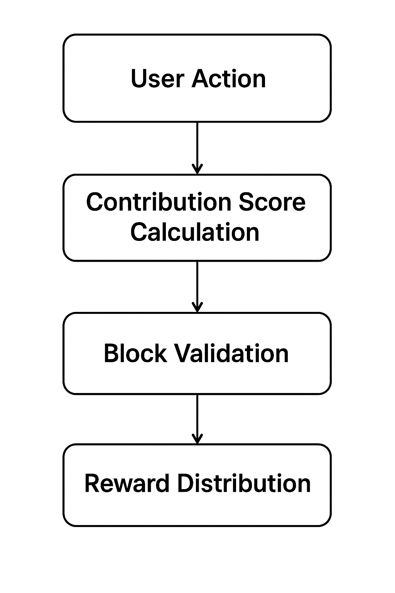

# 🌐 Blockora Technical Blueprint

  

🚀 **Blockora** is a next-generation blockchain protocol designed for **scalability**, **security**, and **community-driven growth**.  
Unlike traditional blockchains, Blockora introduces a **Proof of Contribution (PoC)** consensus mechanism that rewards participants fairly based on their real value to the network.

---

## 📖 Documentation

- 📜 **[Read the Technical Design](./TECHNICAL_DESIGN.md)**  
- 📄 **[Whitepaper](https://blockora.github.io/blockora-whitepaper/)**  

---

## 🖼️ Consensus Flow

  

---

## 🔑 Key Highlights

✅ **Proof of Contribution (PoC):** Rewards based on transactions, governance participation, and community contributions.  
✅ **Scalable Network Layers:** Validator, Contributor, and Observer nodes for optimal performance.  
✅ **Secure Architecture:** TEE-enabled validators, bug bounty programs, and public audits.  
✅ **Developer Friendly:** SDKs for JS, Python, Dart + public testnet for dApp developers.  

---

## 🛠 Roadmap

1️⃣ **Phase 1:** PoC Architecture finalization + testnet launch  
2️⃣ **Phase 2:** Validator & Contributor node setup + DAO governance  
3️⃣ **Phase 3:** Cross-chain bridges + enterprise adoption  
4️⃣ **Phase 4:** AI-Governance + privacy-preserving research  

---

## 🌍 Community & Links

- 🐦 **Twitter:** [Follow us here](https://twitter.com/Blockora_)  
- 💬 **Discord:** Coming Soon  
- 🌐 **Website:** Coming Soon  

---

## 🤝 Contribution

Want to contribute?  
1. **Fork** this repo  
2. Create a new branch `feature/your-feature-name`  
3. Submit a **Pull Request**  

We welcome developers, researchers, and builders to help us shape the future of decentralized networks.  

---

## 📢 Stay Updated

⭐ **Star this repository** to stay updated on development progress.  
🔔 Enable **Watch** for real-time notifications on new commits.  

---

Made with ❤️ by the Blockora Team

